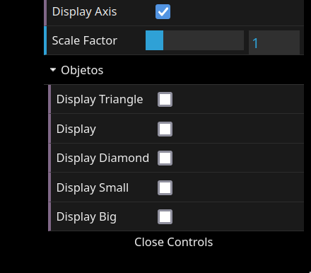

# CG 2023/2024

## Group T09G01

## TP 1 Notes

In this theoretical-practical lesson, we learned about the basics of OpenGL.
We learned that to draw a simple geometric figure, we first need to specify a set of points that allows us to divide the respective figure into triangles. 
We worked with three classes: `CGFscene`, `CFGinterface` and `CGFobject`.

### CFGscene

The `CFGscene` is the class responsible for creating the scene, displaying the objects in the axis and the camera position having the light source in mind. This is basically the main class of the program.

    

### CFGinterface

<table>
    <tr>
        <td width="500px">
            The <strong>CFGinterface</strong> is the class responsible for displaying an interface that allows the user to interact with the program. There already was a checkbox that toggled the axis display, and a slider to change the scale of the objects. For the second exercise, we had to add checkboxes to toggle the display of the objects we were to create. By curiosity, we found that we could add folders to the interface, which we did to organize the checkboxes:
        </td>
        <td>
            
        </td>
    </tr>
</table>

### CGFobject

The `CGFobject` was the class that allowed us to create the objects we wanted to display. We had to create a class for each object, and in each class, as we said before, we had to specify the vertices and the indices of the object. By doing this we were able to create the following figures:

<table>
    <tr>
        <td></td>
        <td>
            <h1>Parallelogram</h1>
            <code>
                this.vertices = [
                0, 0, 0,
                1, 0, 0,
                2, 0, 0,
                3, 1, 0,
                2, 1, 0,
                1, 1, 0,
                ];  
                this.indices = [
                0, 1, 5,
                5, 1, 2,
                5, 2, 4,
                2, 3, 4 
                ];
            </code>
        </td>
    </tr>
    <tr>
        <td></td>
        <td>
        <h1>Diamond</h1>
            <code>
                this.vertices = [
                -1, 0, 0,
                0, -1, 0,
                0, 1, 0, 
                1, 0, 0  
                ];  
                this.indices = [
                0, 1, 2,
                1, 3, 2 
                ];
            </code>
        </td>
    </tr>
    <tr>
        <td></td>
        <td>
        <h1>Small Triangle</h1>
            <code>
                this.vertices = [
                    -1, 0, 0,
                    1, 0, 0, 
                    0, 1, 0, 
                ];  
                this.indices = [0, 1, 2];
            </code>
        </td>
    </tr>
    <tr>
        <td></td>
        <td>
        <h1>Big Triangle</h1>
            <code>
                this.vertices = [
                    -2, 0, 0,
                    2, 0, 0, 
                    0, 2, 0, 
                ];  
                this.indices = [0, 1, 2];
            </code>
        </td>
    </tr>
</table>

